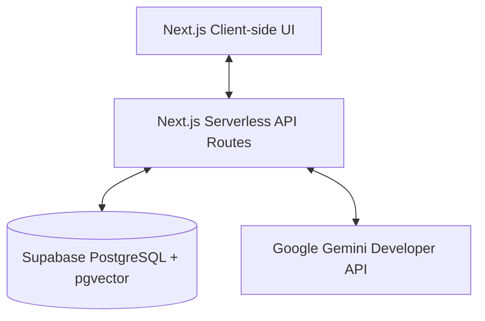

# TCET Admission Assistance Chatbot - Implementation Plan

This document outlines the architecture, database schema, NLP/RAG workflows, high-fidelity UI screens, and deployment steps to build the Admission Assistance Chatbot prototype for Thakur College of Engineering and Technology (TCET), Mumbai, hosted on **Vercel** and powered by **Supabase** (PostgreSQL with `pgvector`).

To run the chatbot on Vercel for free, we will use:
1. **Gemini Developer API (Free Tier)** for embedding and response generation.
2. **Supabase (Free Tier)** for relational tables and vector database storage.
3. **Vercel** for hosting the Next.js serverless application.

---

## Action Plan: Steps for the User

Here is the exact checklist of tasks you need to perform to get the prototype live:

### Step 1: Get Google Gemini API Key (Free)
1. Go to [Google AI Studio](https://aistudio.google.com/).
2. Log in with your Google Account.
3. Click **"Get API Key"** and create a new key.
4. Copy this key (we will save it as `GEMINI_API_KEY`).

### Step 2: Set Up Supabase Database (Free)
1. Sign up/log in to [Supabase](https://supabase.com/).
2. Click **"New project"** and name it `tcet-admission-chatbot`.
3. Set a database password and select a server region close to you (e.g., Mumbai or Singapore).
4. Once the project is created (takes about 1-2 minutes), click on the **SQL Editor** tab in the left navigation sidebar.
5. Click **"New query"**, paste the **Supabase Database SQL Setup Script** (provided below), and click **"Run"**. This will enable vector search, create all required tables, and create the similarity search function.
6. Go to **Project Settings > API** and copy:
   - **Project URL** (we will save it as `NEXT_PUBLIC_SUPABASE_URL`)
   - **API Key (anon/public)** (we will save it as `NEXT_PUBLIC_SUPABASE_ANON_KEY`)

### Step 3: Populate Local Environment
Once we generate the code, create a file named `.env.local` in the root of the project folder and insert:
```env
NEXT_PUBLIC_SUPABASE_URL=https://your-project-id.supabase.co
NEXT_PUBLIC_SUPABASE_ANON_KEY=your-supabase-anon-key
GEMINI_API_KEY=your-gemini-api-key
```

### Step 4: Deploy to Vercel (Free)
1. Push the project code (which I will write) to a private or public GitHub repository.
2. Sign up/log in to [Vercel](https://vercel.com/) using your GitHub account.
3. Click **"Add New" > "Project"**, select your GitHub repository, and import it.
4. In the **Environment Variables** dropdown, add:
   - `NEXT_PUBLIC_SUPABASE_URL`
   - `NEXT_PUBLIC_SUPABASE_ANON_KEY`
   - `GEMINI_API_KEY`
5. Click **"Deploy"**! Vercel will build and host your Next.js app in less than 2 minutes.

---

## Supabase Database SQL Setup Script

You will run this script in the Supabase SQL Editor:

```sql
-- 1. Enable the pgvector extension for semantic similarity search
create extension if not exists vector;

-- 2. Create the Document Chunks table for RAG
create table if not exists document_chunks (
  id uuid default gen_random_uuid() primary key,
  title text not null,
  content text not null,
  source_name text not null,
  source_url text,
  embedding vector(768), -- Dimension 768 matches Gemini's text-embedding-004 model
  created_at timestamp with time zone default timezone('utc'::text, now()) not null
);

-- 3. Create the FAQs table for direct semantic matching
create table if not exists faqs (
  id uuid default gen_random_uuid() primary key,
  question text not null,
  answer text not null,
  category text not null, -- e.g., 'Fees', 'Cutoffs', 'Facilities'
  source_name text,
  source_url text,
  created_at timestamp with time zone default timezone('utc'::text, now()) not null,
  updated_at timestamp with time zone default timezone('utc'::text, now()) not null
);

-- 4. Create the User Query Logs table for Admin Analytics
create table if not exists query_logs (
  id uuid default gen_random_uuid() primary key,
  query text not null,
  detected_intent text,
  is_answered boolean default true not null,
  feedback_score integer, -- 1 for thumbs up, -1 for thumbs down
  created_at timestamp with time zone default timezone('utc'::text, now()) not null
);

-- 5. Create a function for calculating cosine similarity for RAG search
create or replace function match_documents (
  query_embedding vector(768),
  match_threshold float,
  match_count int
)
returns table (
  id uuid,
  title text,
  content text,
  source_name text,
  source_url text,
  similarity float
)
language sql stable
as $$
  select
    document_chunks.id,
    document_chunks.title,
    document_chunks.content,
    document_chunks.source_name,
    document_chunks.source_url,
    1 - (document_chunks.embedding <=> query_embedding) as similarity
  from document_chunks
  where 1 - (document_chunks.embedding <=> query_embedding) > match_threshold
  order by document_chunks.embedding <=> query_embedding
  limit match_count;
$$;
```

---

## Proposed System Architecture



### Components

1. **Frontend (Next.js, TypeScript, Tailwind):**
   - **Main Chatbot Page (`/`):** Portal-like interface with quick-access queries, multi-turn chat bubbles, collapsible citations, and recommended follow-up questions.
   - **Admin Dashboard (`/admin`):** Document upload, FAQ CRUD manager, and analytics (common queries, unanswered questions).
2. **Backend (Next.js App Router API Routes):**
   - `/api/chat`: Pre-processes query, extracts entities (score, branch), calls Gemini embedding API, runs `match_documents` RPC function in Supabase, constructs RAG prompt, calls Gemini generation API, and returns responses.
   - `/api/admin/documents`: Document ingestion, chunking, and embedding generation via Gemini API.
   - `/api/admin/faqs`: FAQ database CRUD operations.
   - `/api/admin/analytics`: Collect and display analytics charts.
3. **Database (Supabase Client):**
   - `@supabase/supabase-js` coordinates transactions and calls database RPC methods, avoiding heavy ORM libraries on serverless functions.

---

## NLP & RAG Workflows

### 1. NLP Pipeline
* **Pre-processing:** Clean spacing, normalize spelling of branches (e.g., "comp", "computer science", "cse" -> "Computer Engineering").
* **Entity & Score Extraction:** Regex extracts percentiles (e.g., "89 percentile", "93% in CET") and score types (MHT-CET vs. JEE Main).
* **Intent Classifier:** Checks keywords to bucket queries into `FEES`, `CUTOFFS`, `DOCUMENTS`, `ELIGIBILITY`, `PROCESS`, or `CONTACT`.
* **FAQ Matcher:** Computes query embedding using Gemini's `text-embedding-004` model. Compares it against FAQs using cosine similarity on the database level or via a simple Supabase query. If similarity is above 0.85, the predefined answer is instantly returned.

### 2. RAG Workflow
If no direct FAQ matches:
1. **Query Embeddings:** Call Gemini's embedding API (`text-embedding-004`) to compute query vector.
2. **Vector Similarity:** Invoke `match_documents` RPC in Supabase to fetch top-3 document chunks with similarity > 0.60.
3. **Context Construction:** Retrieve the top chunks and construct the RAG prompt.
4. **Prompt Engineering:** Inject the retrieved chunks and conversation history into a structured system prompt, forcing strict grounding to prevent hallucinations.
5. **Generation & Citation Mapping:** Execute Gemini API (`gemini-2.5-flash` or `gemini-1.5-flash`). Return the generated answer along with the titles and links (`source_name`, `source_url`) of the referenced chunks.

---

## Proposed UI Screens & Wireframe Layouts

### 1. Main Chat Interface (`/`)
A clean, official college portal look. No futuristic glowing gradients—instead, using TCET colors: deep navy blue (`#0B2545`), gold/amber (`#D4AF37`), and light slate backgrounds (`#F8FAFC`).

* **Header:** TCET Logo, Thakur College of Engineering & Technology, Autonomous status tag, "Official Admission Help Desk" title, and Admin link.
* **Left Sidebar (Quick Access Panel):**
  - **Grid of 6 Cards/Buttons:** Admission Process, Eligibility, Documents Required, Fees, Cutoffs, Contact.
  - **Quick Instructions Alert:** "How to use this system: Ask queries about MHT-CET/JEE cutoffs, document submission, or fee structures."
* **Main Area (Chat View):**
  - Scrollable message container.
  - Welcome Message: "Welcome to TCET Admission Help Desk! I can help you with engineering admissions details. What would you like to know?"
  - Bot Message bubble: Accompanied by a collapsible **"Source Citation"** badge and 2-3 **Suggested Follow-up Prompts** (e.g. "What documents do I need for minority quota?").
* **Bottom Input:** Message bar with send button.

### 2. Admin Dashboard (`/admin`)
* **Header:** "TCET Admission Chatbot Admin Portal" and link back to chat.
* **Sub-Navigation Tabs:**
  - **Dashboard Analytics:** Total queries, category breakdown chart (Canvas/CSS or chart.js), table of recent queries, list of "Unanswered Queries" (with a quick button to add them directly to FAQs).
  - **FAQ Manager:** Simple table of all FAQs. Forms to Add, Edit, or Delete questions and answers.
  - **Document Knowledge Base:** File list of uploaded documents. "Add Document Chunk" form and a bulk PDF drag-and-drop area.

---

## Verification Plan

### Automated Verification
* Verify database connection settings to Supabase.
* Run local integration tests on RAG: verify that embeddings generated by Gemini can successfully query Supabase database and retrieve similarity results.
* Test NLP entity extraction against test queries (e.g., percentiles, branch names, quotas).
* Run `npm run build` to verify TypeScript compiler correctness and asset optimization.

### Manual Verification
* Start the Next.js app, configure `GEMINI_API_KEY` and Supabase keys in `.env`, and test connectivity.
* Test multilingual queries (Hindi and Marathi) and verify the LLM replies in the same language.
* Test the flow of uploading a new document via the Admin panel and immediately asking a question related to it to verify RAG updates.
* Verify mobile layout responsiveness using Chrome DevTools viewport simulation.
